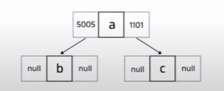
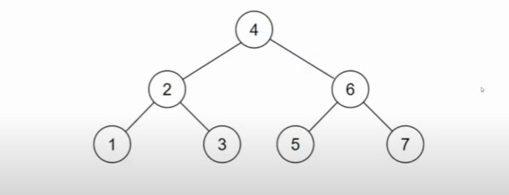
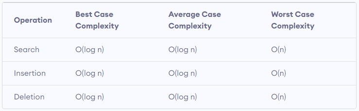

# Binary Search Tree
source: [Youtube: Insinyur Online](https://www.youtube.com/watch?v=4tZDfvfXBb4&list=PL54Ypjb3VYvDS2yvvWr3hpnvVKDPh4Gg6&index=8)
## Tree Data Structure
Tree is a data structure consisting of a set of nodes that are connected by more than one other node.

The smallest element of tree data structure called __node__. Each node store 2 types of information: data and address of connected nodes.

- __node a__ is called __root node__. node a is a __parent__ of node b and node c.
- __node b__ and __node c__ is a __child__ of node a

## Binary Search Tree Characteristics
- a tree data structure called binary if each node has zero, one, or two child node.
- Each node has only 1 max of left node and 1 max of right node.
- child node on the left side of parent node has smaller value than the value of parent node.
- child node on the right side of parent node has bigger value than the value of parent node.

### Example of Binary Search Tree

### Binary Search Tree Complexity

# Test Explanation
Test consists of insert and delete operation. All the test scenarios is on `binary_search_tree_test.py`

# Run Test
`python -m unittest -v binary_search_tree_test.py`